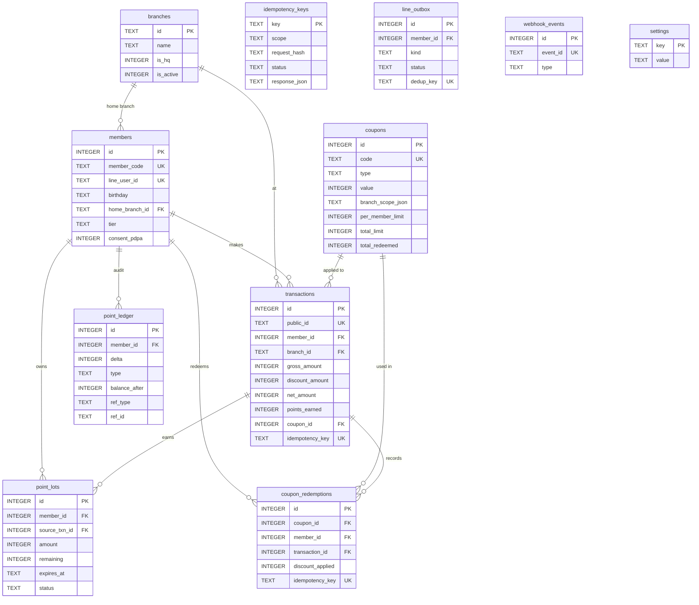
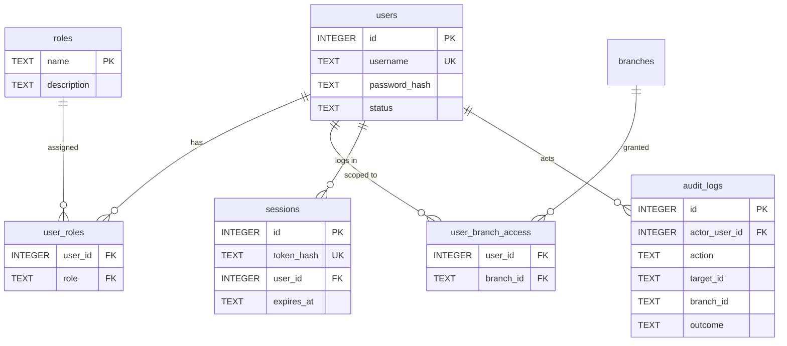
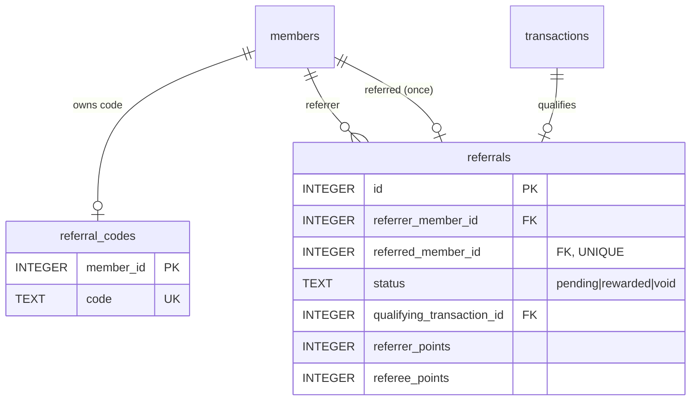
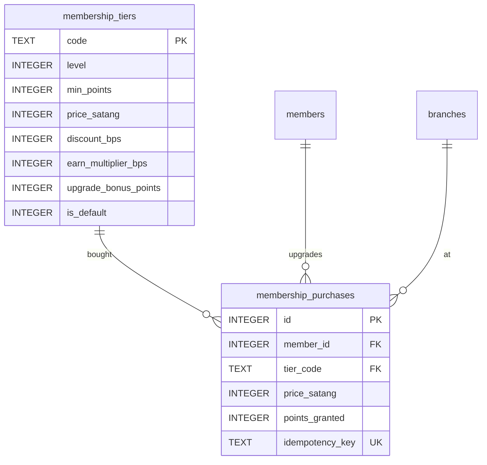

# Fruit Addicts CRM — Data Model (ERD)

All money is **integer satang** (1 THB = 100 satang). Points are whole integers.
The point balance is derived from **`point_lots`** (FIFO, expiry-aware);
**`point_ledger`** is an immutable audit trail.

## Auth / RBAC / audit (migration 002)

- Passwords: scrypt, self-describing hash. Sessions store only the **SHA-256** of the
  token (12h TTL). Roles/permissions live in code (`src/domain/rbac.ts`); branch scoping
  via `user_branch_access`. Every sensitive action + denied attempt lands in `audit_logs`.

## Referral (migration 003)

- A member is referable **once** (`UNIQUE referred_member_id`); **self-referral**
  blocked by a `CHECK`. Reward fires on the **first qualified purchase** (net ≥
  `referral.reward.minFirstPurchaseSatang`) inside the purchase transaction; the
  `pending → rewarded` status flip is atomic, so it pays out **exactly once**.
  Rewards are granted through the immutable point ledger. Values live in the
  policy layer (`referral.enabled`, `referral.reward`) — disabled by default.

## Membership tiers (migration 004)

- `members.tier` holds the current tier code (default `bronze`). Tiers auto-promote
  by accumulated lifetime points (`min_points`); `members.paid_tier_level` is the
  floor set by paid upgrades so paid members never auto-demote. `discount_bps` +
  `earn_multiplier_bps` apply automatically at purchase (discount stacks with coupons,
  capped; multiplier after the coupon multiplier). Paid upgrades are atomic +
  idempotent + audited; the fee is **recorded** (collected offline, not processed).

## Integrity rules enforced in code
- **Atomic**: coupon check + usage increment + transaction row + point lot + ledger
  entry all commit in one `BEGIN IMMEDIATE` transaction, or none do.
- **Idempotent**: every side-effecting write goes through `idempotency_keys`
  (same key → stored response replayed; same key + different body → 409).
- **No negative points**: redemption/negative-adjust consume only available,
  non-expired lots and throw `422` if short.
- **FIFO expiry**: `expireLots` zeroes past-due lots and writes an `expire`
  ledger row per member; `getBalance` already excludes expired lots pre-sweep.
